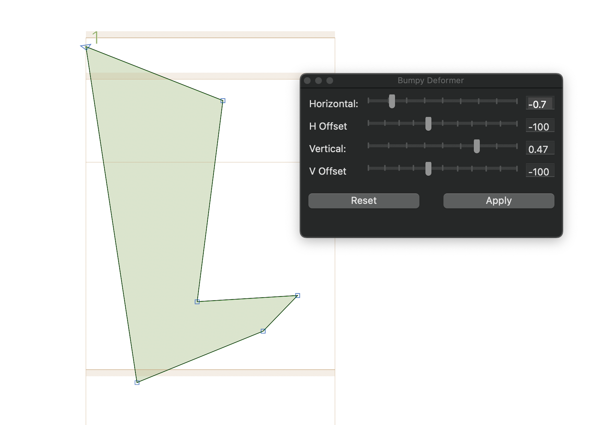

# About
Scripts for the font editor [Glyphs3](https://glyphsapp.com/) 

# Script
* **[Bumpy Deformer](https://github.com/toktaro/Glyphs-Scripts/blob/main/scripts/BumpyDeformer.py)**: Apply shape transformations similar to Adobe Illustrator's Warp effect ( Bumpy, Curve:0% ).

* **[Add All Side SB Anchors](https://github.com/toktaro/Glyphs-Scripts/blob/main/scripts/AddAllSideSBAnchors.py)**: This script adds, updates, and deletes TSB/BSB and LSB/RSB anchor pairs to selected layers. Anchors can be positioned by specifying an offset from the glyph's bounds or from the metrics center. It assists in setting up anchor-based proportional metrics, especially useful for glyphs in CJK fonts.

* **[Fit Metrics to SB Anchors](https://github.com/toktaro/Glyphs-Scripts/blob/main/scripts/FitMetricstoSBAnchors.py)**: This script automatically sets a glyph's width and height based on the positions of SB anchors. It is particularly useful for designing custom anchor-based proportional metrics in CJK fonts. Additionally, it includes a function to check for the presence of SB anchor pairs, allowing you to verify them before execution.

# Installation

## 1. Install Required Modules

1. In Glyphs 3, go to **Window → Plugin Manager**.
2. Open the **Python Modules** tab.
3. Click **Install** for: **Python** , **Vanilla**

## 2. Download the Script

1. On GitHub, open the `.py` script file.
2. Download it via: **Code → Download ZIP**, or **Raw → Right Click → Save As...**

## 3. Place the Script in Glyphs' Scripts Folder

1. In Glyphs 3, go to **Script → Open Scripts Folder**.
2. Copy the downloaded `.py` file into this folder.  
   (You may create subfolders to organize your scripts.)
3. Back to Glyphs 3, hold down the Option key and choose Script > Reload Scripts (Cmd-Opt-Shift-Y).
4. the script will appear in the **Script** menu in Glyphs 3.
   Select it to run.

## License
This project is provided under a custom license. See the [LICENSE](LICENSE) file for details.
